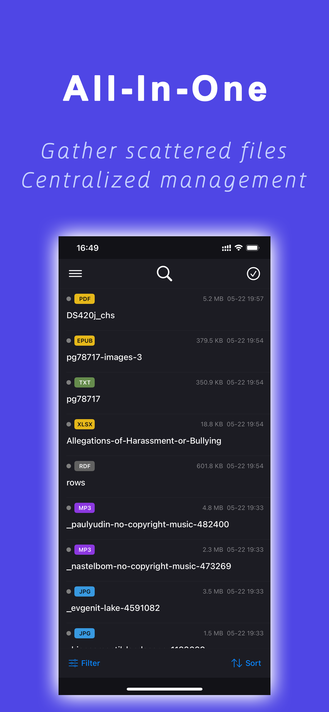

<!-- Hero Image -->

  

  
  
  
  
  
  
  
  
  

  <b>Language:</b>
  English |
  <a href="README.zh-Hans.md">简体中文</a> |
  <a href="README.zh-Hant.md">繁體中文</a> |
  <a href="README.ja.md">日本語</a> |
  <a href="README.ko.md">한국어</a> |
  <a href="README.es.md">Español</a>

---

# PouchVerse

> **Built on the minute, acting in simplicity.**  
> Gather all your scattered files into one unified hub — search, preview, and transfer at the speed of thought.

PouchVerse is a **local-first, offline-capable** personal file manager for **mobile** (iOS & Android). **PouchVerse Transfer** (macOS / Windows) is the companion desktop app for high-speed LAN file transfer. No account registration. No cloud uploads. No subscriptions. All your files stay **entirely on your device**, under your complete control.

---

## One for All

### Files Have Never Been in One Place

Files in the real world are always scattered.

Phone gallery, chat history, downloads folder, each app with its own copy.\
Looking for a document often means switching between different places — or saving it multiple times.

The original idea was simple:\
Bring all files into one place, and manage them uniformly.

So that finding a file is no longer a matter of luck.

### A Single Photo That Changed Everything

There's a photo from a summer 2026 team beach trip.

With the traditional approach, it has to go into a single folder:\
"2026"? "Team Building"? "Beach"? "Work Photos"?

But the photo itself doesn't belong to just one place.

So we started rethinking what "storing" means.\
Files no longer have to belong to a single folder — from the beginning, they are no longer bound by paths.

Physical storage is hidden; users no longer face structure directly.\
Instead, the information itself is freed and can be organized by multiple dimensions simultaneously:\
2026, Summer, Beach, Team Building — any of these can become an entry point.

### Files Are Understood the Moment They Enter

When a file is imported into the system, it has already changed.

It is no longer just a static file — it becomes a reprocessed unit of information:\
Fingerprint calculated, content recognized, text extracted, OCR completed, index built, thumbnail generated, and for Chinese content, Pinyin and initials are processed.

All of this happens at the moment of entry.

Traditional folders don't do any of this.\
They only handle "putting it in" — here, we handle "making it findable."

From the moment a file enters, it is already understandable, searchable, and associatable.

### Information Flows Across All Devices

Once information is structured, it is no longer bound by device.

Mobile and tablet become core nodes: responsible for importing, managing, and holding digital assets.\
Desktop becomes the processing node: for organizing and refining important content, then flowing it back into the system.\
TV becomes the consumption node: all information can be instantly synced and browsed as a stream.

They no longer each maintain their own file system — instead they share one unified information structure.

Files are no longer "on a device" — they always belong to one system, flowing across different contexts.

---

## ✨ Why PouchVerse?

On modern smartphones, files are scattered across social apps, emails, and browsers. Traditional file managers, ported from desktop "folder tree" logic, fail to handle this fragmentation efficiently.

**PouchVerse takes a different approach:**

- **Unified File Hub** — Collect files from any app into one centralized, indexed repository.
- **Physical Deduplication** — SHA-256 fingerprinting detects identical content regardless of filename, reclaiming precious storage on 128 GB / 256 GB devices.
- **6D Flexible Organization** — Organize files the way you *think*: tags, importance, virtual folders, usage labels — one file, many attributes, no duplication.
- **Instant Offline Search** — Full-text search across filenames, document content, image OCR text, and manually-triggered audio transcription. Entirely on-device.
- **All-Format Preview** — Docs, code, video, audio, archives, images — one tap, instant preview, no external app needed.
- **Pro Media Player** — Precision dual-zone video seek controls and artwork-rich audio player.
- **Cross-Platform Transfer** — High-speed peer-to-peer LAN transfer across all platforms; Apple devices support direct connection without Wi-Fi.
- **Biometric Private Space** — Face ID / Touch ID protected private folder. 100% local.

---

## 📥 Download

| Platform | Status | Link |
|---|---|---|
| **iOS** (iPhone & iPad) | ✅ **v1.0.2 Live** | [🛒 App Store](https://apps.apple.com/app/id6766184837) |
| **macOS** (Transfer) | ✅ **v1.0 Live** | [🛒 App Store](https://apps.apple.com/app/id6773520285) |
| **Android** | 🟡 **v1.0 Under Review — Google Play** | — |
| **Windows** (Transfer) | ✅ **v1.0 Live** | [⬇️ Download](https://github.com/ejiandan/PouchVerse-release/releases/tag/v1.0.0) · [🏪 Microsoft Store](https://apps.microsoft.com/detail/9MWN47WXN7S8) |
| **tvOS** (Apple TV) | 🟡 **v1.0 Under Review — App Store** | [🧪 v1.0 TestFlight](https://testflight.apple.com/join/nzK9xWhJ) |
| **Android TV** | 🔜 Coming Soon | — |

> 📌 **PouchVerse Transfer** (macOS / Windows) is a companion app focused on LAN file transfer. Full file management is available on **iOS & Android**; **tvOS** v1.0 is under App Store review, and **Android TV** is coming soon. TV versions use your phone as the data source — they are a big-screen companion for enjoying videos, photos, and music already in your PouchVerse library.
>
> ⭐ **Star this repo** to get notified when new platforms launch.

---

## 🔑 Key Features at a Glance

| Feature | Description |
|---|---|
| **File Unification** | Import from any app, Files picker, or LAN transfer into one indexed library |
| **SHA-256 Deduplication** | Physical-level duplicate detection — same content = same storage slot |
| **6D Organization** | Virtual folders · Tags · Colour importance (5 levels) · Usage labels · Time |
| **Full-Text Search** | Filenames · Document body · Image OCR · Pinyin / initials for Chinese · Audio transcription |
| **All-Format Preview** | 80+ file types: video · audio · images · PDF · Office · code · archives · ISO |
| **LAN Transfer** | Bonjour peer discovery + custom TCP direct transfer, no relay server |
| **Private Files** | Biometric in-app access control — re-locks on every background |
| **No Internet Required** | All intelligence (OCR, speech-to-text, search) runs fully on-device |
| **One-time Purchase** | No subscription, no ads, no account |

---

## 📱 Screenshots

  
  
  
  
  

> Full screenshot set (iPhone & iPad, 6 languages) is available in [`/Assets/Screenshots/`](Assets/Screenshots/).

---

## 📚 Documentation

| Document | Description |
|---|---|
| [Quick Start](Manual/Quick-Start.md) | Get up and running in 5 minutes |
| [Transfer Guide](Manual/Transfer-Guide.md) | LAN file transfer across all platforms |
| [FAQ](Manual/FAQ.md) | Common questions and answers |
| [Privacy Policy](Legal/Privacy-Policy.md) | What we collect (spoiler: nothing) |
| [Terms of Service](Legal/Terms-of-Service.md) | Usage terms |

---

## 🛡️ Privacy Promise

PouchVerse is built on a **local-first / offline-capable** philosophy:

- ❌ No account registration
- ❌ No personal data collection
- ❌ No file uploads to any server
- ❌ No third-party analytics, ads, or tracking SDKs
- ✅ All AI features (OCR, speech-to-text, Pinyin indexing) run 100% on-device using Apple system frameworks
- ✅ LAN Transfer is peer-to-peer with no relay server

See the full [Privacy Policy](Legal/Privacy-Policy.md) for details.

---

## 💬 Feedback & Support

- **Email:** [support@ejiandan.com](mailto:support@ejiandan.com)
- **Issues:** [Open an issue](https://github.com/ejiandan/PouchVerse-release/issues) for bug reports or feature requests

---

## ⭐ Support the Project

If PouchVerse is useful to you, please consider:

- ⭐ **Starring this repository** — it helps others discover the project
- 📝 **Leaving a review** on the [App Store](https://apps.apple.com/app/id6766184837)
- 📢 **Sharing** with friends who need a better file manager

---

## 📄 Legal

Copyright © 2026 EJIANDAN LIMITED (藝簡單有限公司). All rights reserved.

- [Privacy Policy](Legal/Privacy-Policy.md)
- [Terms of Service](Legal/Terms-of-Service.md)
- [Open Source Licences](Legal/Open-Source-Licences.md)
