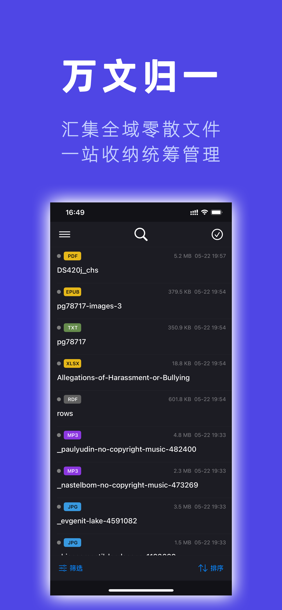
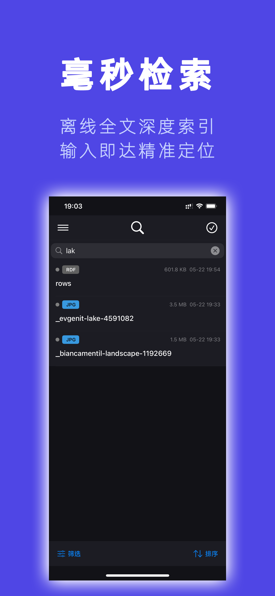
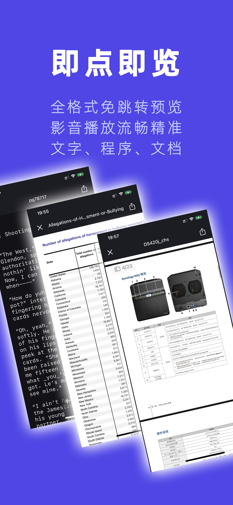
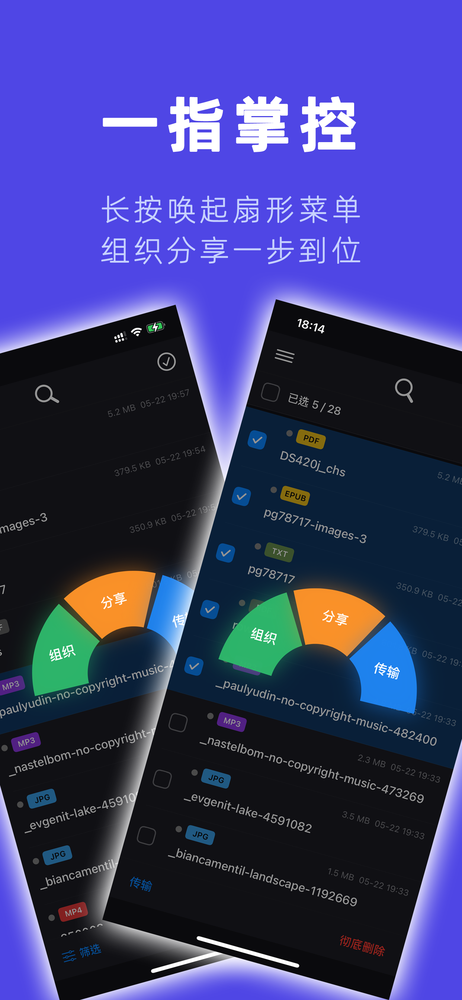
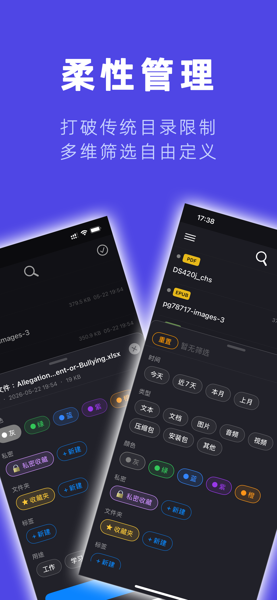

<!-- Hero Image -->

  

  
  
  
  
  
  

  <b>语言：</b>
  <a href="README.md">English</a> |
  简体中文 |
  <a href="README.zh-Hant.md">繁體中文</a> |
  <a href="README.ja.md">日本語</a> |
  <a href="README.ko.md">한국어</a> |
  <a href="README.es.md">Español</a>

---

# 储物袋 · PouchVerse

> **构于微，行于简 · 汇集群文，速览无滞**  
> 将散落各处的文件汇入统一的本地库，搜索、预览、互传一气呵成。

储物袋是一款**本地优先 / 离线可用**的个人文件管理应用，专为**手机与平板**（iOS 和 Android）打造；**储物袋 Transfer**（macOS / Windows）为桌面平台提供高速局域网互传功能。无需注册账号，无云端上传，无订阅。您的全部文件**始终存储于您的设备本地**，完全由您掌控。

---

## ✨ 为什么选择储物袋？

手机上的文件散落在微信、邮件、浏览器……传统文件管理器照搬桌面"目录树"逻辑，无法高效应对这种碎片化。

**储物袋采用全新方案：**

- **万文归一** — 从任意 App 导入，统一收纳、建索引、供预览。
- **物理级去重** — SHA-256 数字指纹精准识别相同内容（与文件名无关），帮助 128 GB / 256 GB 设备用户节省大量空间。
- **六维柔性组织** — 按您的思维逻辑组织：标签、重要度、虚拟文件夹、用途标注——一个文件，多重归属，无物理复制。
- **毫秒级离线检索** — 全文检索覆盖文件名、文档正文、图片 OCR 文本、中文拼音首字母，以及按需触发的音频语音转写。全部在设备本地完成。
- **全格式速览** — 文档、代码、视频、音频、压缩包、图片……一键直接预览，无需跳转外部应用。
- **专业影音播放** — 自研双区精准视频跳转控件，封面信息丰富的音频播放器。
- **跨平台互传** — 局域网点对点高速直传，苹果设备间无需 WiFi 即可直连。
- **生物识别私密空间** — Face ID / Touch ID 保护的私密文件夹，100% 本地存储。

---

## 📥 下载

| 平台 | 状态 | 链接 |
|---|---|---|
| **iOS**（iPhone 和 iPad） | ✅ **已通过审核，6.16 上线** | [🧪 Beta TestFlight](https://testflight.apple.com/join/8t2n7tmd) |
| **macOS Transfer** | 🟡 **审核中，6.16 上线** | [🧪 Beta TestFlight](https://testflight.apple.com/join/5Bk89gBb) |
| **Android** | � **v1.0 审核中 — Google Play** | — |
| **Windows Transfer** | ✅ **已通过审核，6.16 上线** | [⬇️ 下载](https://github.com/ejiandan/PouchVerse-release/releases/tag/v1.0.0) · 🏪 Microsoft Store |
| **tvOS**（Apple TV） | 🔜 即将推出 | — |

> 📌 **储物袋 Transfer**（macOS / Windows）为桌面平台提供局域网互传功能；完整文件管理功能适用于 **iOS、Android 与 tvOS**。tvOS 版功能框架与 iOS 版一致，图片、音乐、视频预览针对电视操作优化。

> ⭐ **Star 本仓库**，第一时间获知新平台上线通知。

---

## 🔑 核心功能一览

| 功能 | 说明 |
|---|---|
| **万文归一** | 从任意 App、文件选择器或局域网传输导入，统一索引 |
| **SHA-256 去重** | 物理层内容识别——相同内容只占一份存储 |
| **六维组织** | 虚拟文件夹 · 标签 · 颜色重要度（5 级）· 用途标注 · 时间 |
| **全文检索** | 文件名 · 文档正文 · 图片 OCR · 中文拼音/首字母 · 音频转写 |
| **全格式预览** | 80+ 种文件格式：视频 · 音频 · 图片 · PDF · Office · 代码 · 压缩包 · ISO |
| **局域网互传** | Bonjour 设备发现 + 自定义 TCP 直传，无中转服务器 |
| **私密文件** | 生物识别的应用内访问门控——每次切后台即重锁 |
| **无需联网** | OCR、语音转写、检索均完全在设备本地运行 |
| **一次买断** | 无订阅、无广告、无账号 |

---

## 📱 截图预览

  
  
  
  
  

> 完整截图集（iPhone & iPad，6 种语言）位于 [`/Assets/Screenshots/`](Assets/Screenshots/)。

---

## 📚 文档

| 文档 | 说明 |
|---|---|
| [快速上手](Manual/Quick-Start.md) | 5 分钟内完成第一次导入 |
| [互传指南](Manual/Transfer-Guide.md) | 跨平台局域网文件传输 |
| [常见问题](Manual/FAQ.md) | 常见疑问解答 |
| [隐私政策](Legal/Privacy-Policy.md) | 我们收集什么（剧透：什么都不收集） |
| [用户协议](Legal/Terms-of-Service.md) | 使用条款 |

---

## 🛡️ 隐私承诺

储物袋坚守**本地优先 / 离线可用**的产品原则：

- ❌ 无账号注册
- ❌ 不收集任何个人数据
- ❌ 不上传任何文件到服务器
- ❌ 不内置任何第三方分析、广告或追踪 SDK
- ✅ 所有 AI 功能（OCR、语音转写、拼音索引）均调用 Apple 系统框架，100% 在设备本地运行
- ✅ 局域网互传点对点直连，无中转服务器

详见完整[隐私政策](Legal/Privacy-Policy.md)。

---

## 💬 反馈与支持

- **邮件：** support@ejiandan.com
- **Issues：** [提交问题](https://github.com/ejiandan/PouchVerse-release/issues)报告 Bug 或建议功能

---

## ⭐ 支持项目

如果储物袋对您有帮助，欢迎：

- ⭐ **Star 本仓库** — 帮助更多人发现这个项目
- 📝 在 App Store **留下评价**（6.16 开放）
- 📢 **分享**给需要更好文件管理工具的朋友

---

## 📄 法律声明

版权所有 © 2026 北京艺简单网络科技有限公司。保留所有权利。

- [隐私政策](Legal/Privacy-Policy.zh-Hans.md)
- [用户协议](Legal/Terms-of-Service.zh-Hans.md)
- [开源许可声明](Legal/Open-Source-Licences.md)
