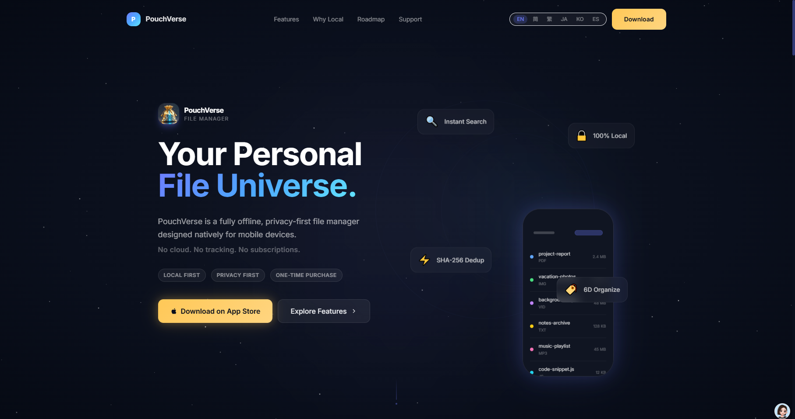

<!-- Hero Image -->

  

  
  
  
  
  
  
  
  

  <b>語言：</b>
  <a href="README.md">English</a> |
  <a href="README.zh-Hans.md">简体中文</a> |
  繁體中文 |
  <a href="README.ja.md">日本語</a> |
  <a href="README.ko.md">한국어</a> |
  <a href="README.es.md">Español</a>

---

# 儲物袋 · PouchVerse

> **構於微，行於簡 · 匯集群文，速覽無滯**  
> 將散落各處的文件匯入統一的本地庫，搜索、預覽、互傳一氣呵成。

儲物袋是一款**本地優先 / 離線可用**的個人文件管理應用，專為**手機與平板**（iOS 和 Android）打造；**儲物袋 Transfer**（macOS / Windows）為桌面平台提供高速局域網互傳功能。無需註冊帳號，無雲端上傳，無訂閱。您的全部文件**始終存儲於您的裝置本地**，完全由您掌控。

---

## ✨ 為什麼選擇儲物袋？

手機上的文件散落在微信、電郵、瀏覽器……傳統文件管理器照搬桌面「目錄樹」邏輯，無法高效應對這種碎片化。

**儲物袋採用全新方案：**

- **萬文歸一** — 從任意 App 導入，統一收納、建索引、供預覽。
- **物理級去重** — SHA-256 數字指紋精準識別相同內容（與文件名無關），幫助 128 GB / 256 GB 設備用戶節省大量空間。
- **六維柔性組織** — 按您的思維邏輯組織：標籤、重要度、虛擬文件夾、用途標注——一個文件，多重歸屬，無物理複製。
- **毫秒級離線檢索** — 全文檢索覆蓋文件名、文檔正文、圖片 OCR 文本、中文拼音首字母，以及按需觸發的音頻語音轉寫。全部在設備本地完成。
- **全格式速覽** — 文檔、代碼、視頻、音頻、壓縮包、圖片……一鍵直接預覽，無需跳轉外部應用。
- **專業影音播放** — 自研雙區精準視頻跳轉控件，封面信息豐富的音頻播放器。
- **跨平台互傳** — 局域網點對點高速直傳，蘋果設備間無需 WiFi 即可直連。
- **生物識別私密空間** — Face ID / Touch ID 保護的私密文件夾，100% 本地存儲。

---

## 📥 下載

| 平台 | 狀態 | 連結 |
|---|---|---|
| **iOS**（iPhone 和 iPad） | ✅ **已通過審核，6.16 上線** | [🧪 Beta TestFlight](https://testflight.apple.com/join/8t2n7tmd) |
| **macOS** (Transfer) | 🟡 **審核中，6.16 上線** | [🧪 Beta TestFlight](https://testflight.apple.com/join/5Bk89gBb) |
| **Android** | 🟡 **v1.0 審核中 — Google Play** | — |
| **Windows** (Transfer) | ✅ **已通過審核，6.16 上線** | [⬇️ 下載](https://github.com/ejiandan/PouchVerse-release/releases/tag/v1.0.0) · 🏪 Microsoft Store |
| **tvOS**（Apple TV） | 🧪 **Alpha 內部測試** | — |
| **Android TV** | 🔜 即將推出 | — |

> 📌 **儲物袋 Transfer**（macOS / Windows）為桌面平台提供局域網互傳功能；完整文件管理功能適用於 **iOS 與 Android**；**tvOS** 版正在進行 Alpha 內部測試，**Android TV** 版即將推出。電視版功能框架與 iOS 版一致，圖片、音樂、視頻預覽針對電視操作優化。

> ⭐ **Star 本倉庫**，第一時間獲知新平台上線通知。

---

## 🛡️ 隱私承諾

儲物袋堅守**本地優先 / 離線可用**的產品原則：

- ❌ 無帳號註冊
- ❌ 不收集任何個人數據
- ❌ 不上傳任何文件到服務器
- ❌ 不內置任何第三方分析、廣告或追蹤 SDK
- ✅ 所有 AI 功能均調用 Apple 系統框架，100% 在設備本地運行
- ✅ 局域網互傳點對點直連，無中轉服務器

---

## 💬 反饋與支持

- **郵件：** support@ejiandan.com
- **Issues：** [提交問題](https://github.com/ejiandan/PouchVerse-release/issues)

---

版權所有 © 2026 EJIANDAN LIMITED（藝簡單有限公司）。保留所有權利。
